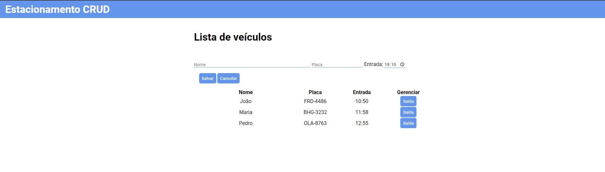
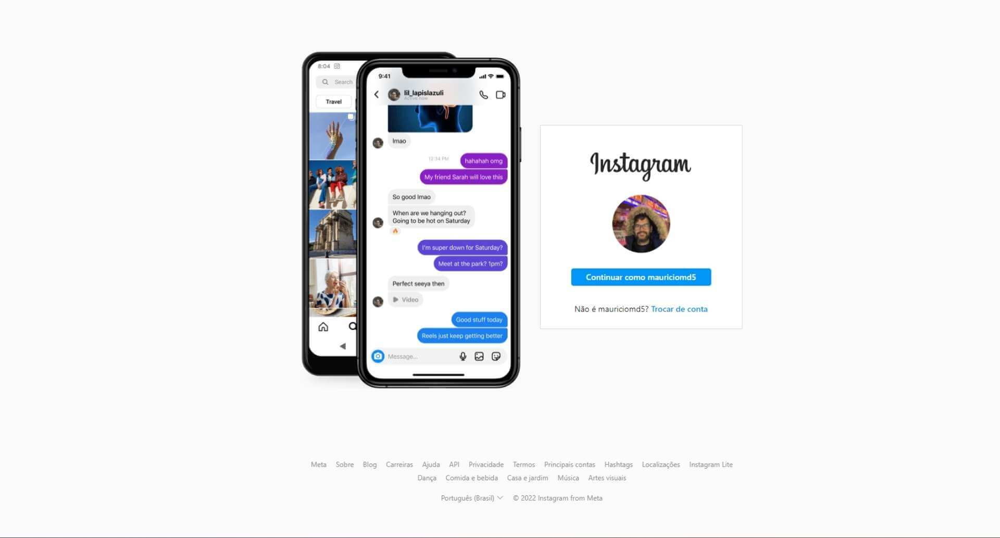

# Olá mundo. Eu sou o Maurício.👋
## Sobre mim

Desenvolvedor de aplicações web. Tenho praticado React, Javascript, Typescript, Node.js, MySql e Java.

Moro em São Paulo/SP. Sou brasileiro e português.

 

## Projetos de destaque

<a href="https://github.com/Mauricio-MdS/estacionamento-crud"> <h3> Cadastro de estacionamento</h3></a>

Cadastro de veículos em um estacionamento com Typescript

 

<a href="https://github.com/Mauricio-MdS/instagram-login"> <h3> Instagram Login Clone</h3></a>

Criação de tela responsiva da página de login do Instagram, com carrossel de imagens.

 

