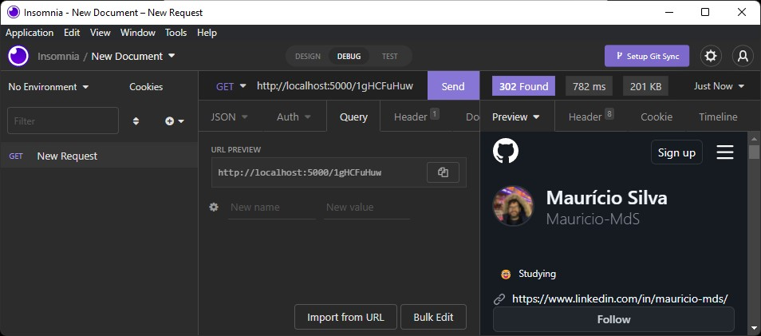

# Hello World, I'm Mauricio.👋

[Leia em português brasileiro](./LEIAME.md)

Recently I have been developing my skills in Java and Spring. Check my linkedin:

 

## Tech skills

Java, Spring, REST APIs, HTTP, JUnit, Unit Tests, TDD, SQL (MySQL, PostgreSQL), NoSQL (MongoDB), Git, Github, Linux, Nodejs, Javascript, Typescript, Express, React, HTML, CSS, Bootstrap

## Projects

<a href="https://github.com/Mauricio-MdS/imdb-top-movies"> <h3> IMDB Top Movies</h3></a>

  
    

Searcher for the 250 top movies on IMDB.

 

<a href="https://github.com/Mauricio-MdS/url-shortener-api"> <h3> URL Shortener</h3></a>

  
               
               
  
  

REST API URL shortener written in Nodejs/Typescript. It has data persistence using MongoDB (NoSQL database).

